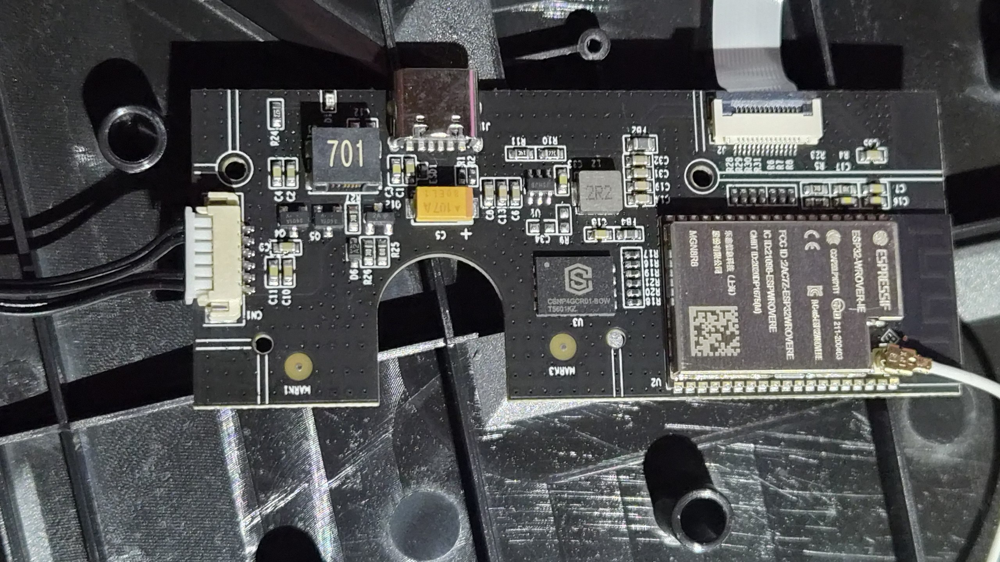
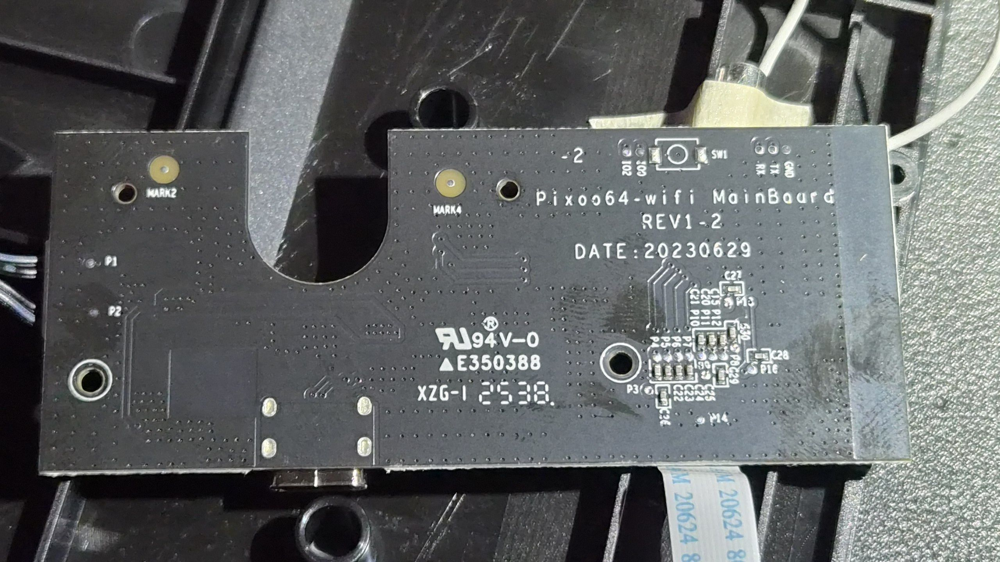

# WLED for Divoom Pixoo 64

Mainline [WLED](https://github.com/Aircoookie/WLED) running on the **Divoom
Pixoo 64** (64×64 RGB LED matrix) via a custom bus driver (`BusPixoo`) that
speaks the panel's internal SPI packet protocol. ~30 fps DDP streaming, full
WLED feature set (220 effects, 2D matrix, playlists, Home Assistant, E1.31 /
ArtNet / DDP), OTA updates — no Divoom cloud, no Divoom app.

Stock firmware was: 1 fps over its HTTP API and a mandatory vendor app.
This port: ~30 fps realtime streaming and the entire WLED ecosystem.

Don't want to build? Grab the ready `firmware.bin` from
[Releases](https://github.com/acidmiku/pixoo64-wled/releases) and skip to
[Flash](#flash).




## Hardware

- **ESP32-WROVER-IE** (ESP32-D0WD-V3 rev 3.1), 8 MB flash (DIO/40 MHz),
  4 MB PSRAM. Board silkscreen: `Pixoo64-wifi MainBoard REV1-2`. No SD slot on
  this revision; USB-C is power-only.
- The ESP32 talks to a **separate LED-driver board** over internal SPI:
  **CLK=GPIO25, MOSI=GPIO33, CS=GPIO26**, no MISO, mode 0, MSB first, 8 MHz.
  No panel-enable GPIO exists — three wires drive everything.
- eFuses (read via `espefuse summary`): secure boot **off**, flash encryption
  **off**, anti-rollback counter 0, UART download **enabled**. The stock
  bootloader has no app-rollback support.

## LED board packet protocol

Every SPI message is a packet:

```
0xAA | len_lo | len_hi | cmd | payload(len bytes) | 0xBB
```

`len` counts payload bytes only (excludes the 4-byte header and the tail).

| cmd  | meaning | payload |
|---|---|---|
| `0x00` | frame data | `width*height*3` bytes RGB888, pixel `y*64+x`, R,G,B order, top-left origin |
| `0x01` | brightness | 1 byte, 0–100 |
| `0x21` | padding | zeros (see below) |
| `0x22` | LED current | 3 bytes `{75,75,75}`, sent once at boot |

A full frame is the DATA packet (`4 + 12288 + 1` bytes) **immediately followed
by a 240-byte UNUSED padding packet** (`AA EB 00 21 <235 zeros> BB`) — the
driver board's SPI DMA chunk is 240 bytes and it ignores the tail of a frame
without it. The whole 12533-byte frame is one SPI transfer (one CS assertion):
~12.5 ms at 8 MHz, theoretically ~75 fps.

Protocol reference: the [ESPHome `pixoo` component](https://esphome.io/components/display/pixoo/)
([PR #16974](https://github.com/esphome/esphome/pull/16974), proven on real
hardware) — `BusPixoo` is a line-faithful port of it into WLED's bus API.

## Build

```
git clone https://github.com/acidmiku/pixoo64-wled.git
cd pixoo64-wled             # lands on the pixoo64 branch (repo default)
pip install platformio      # skip if you already have PlatformIO Core
pio run -e pixoo64          # -> .pio/build/pixoo64/firmware.bin (~1.34 MB)
```

Platform/toolchain and libraries download automatically on first build.

- Env `pixoo64` in `platformio_override.ini`: `esp-wrover-kit`, flash 8 MB
  DIO/40 MHz, PSRAM, partition table `tools/pixoo64_partitions.csv`.
- The partition CSV preserves the **stock Divoom offsets** (dual 2560 KB OTA
  slots + 3008 KB FS) so the stock bootloader keeps working and stock restore
  stays a single full-dump write. The FS partition **must be labeled `spiffs`**
  — WLED mounts LittleFS by that label; anything else silently fails and no
  config persists.
- Driver code: `wled00/bus_manager.{h,cpp}` (`TYPE_PIXOO64 = 72`, guarded by
  `WLED_ENABLE_PIXOO64`), default bus/pins via build flags.

## Flash

You need one UART session (USB-UART adapter, 3.3 V): GND/TX/RX, and **strap
IO0 to GND** to enter download mode (remove the strap to run). **Back up the
stock firmware first** — it's your restore path:

```
esptool --port COMx --baud 921600 read-flash 0x0 0x800000 stock_backup.bin
```

Then flash WLED into both OTA slots, the fixed partition table, and erased
otadata (deterministic boot):

```
esptool --port COMx --baud 921600 write-flash \
  0x10000 firmware.bin 0x290000 firmware.bin \
  0x8000 partitions.bin \
  0xD000 pixoo64/otadata_erased.bin
```

- **`partitions.bin` is required** (`wled/.pio/build/pixoo64/partitions.bin`
  after building, or from Releases): the stock Divoom table labels the
  filesystem partition `storage`, but WLED mounts LittleFS by the label
  `spiffs`. Without it the panel runs but **persists nothing** — WiFi and
  config are lost on every reboot (`fs.t: 0` in `/json/info`). Offsets and
  sizes are otherwise identical to stock, so stock restore stays a single
  full-dump write. (Early release notes omitted this file — if you flashed
  without it, re-flash just `0x8000 partitions.bin`; no need to redo the rest.)
- `pixoo64/otadata_erased.bin` is in this repo — 8192 bytes of 0xFF, i.e. an
  erased otadata partition.

**Panel already closed with no UART and a broken FS?** A community member
repaired theirs over WiFi: an OTA-flashed intermediate firmware that rewrites
only the 0x8000 partition sector, then reboots — afterwards normal OTA works.
See the r/WLED thread linked from the repo discussions if you need that path.

First boot: `WLED-AP` (password `wled1234`) → http://4.3.2.1 → set your WiFi.

**From then on, OTA over WiFi:** WLED UI → Security & Updates, or
`curl -F "update=@firmware.bin" http://<ip>/update`. Verified working.

**Restore stock:** `esptool write-flash 0x0 stock_backup.bin`. Stock images
are unsigned and the bootloader does no rollback, so this always works.

## Recommended first-boot config

- **2D matrix** (applies after a reboot): Config → 2D Configuration → one
  64×64 panel, top-left origin, no serpentine. JSON equivalent:
  ```json
  {"hw":{"led":{"matrix":{"mpc":1,"panels":[{"b":0,"r":0,"v":0,"s":0,"x":0,"y":0,"w":64,"h":64}]}}}}
  ```
  The bus is already plain row-major, so this maps 1:1.
- **Streaming:** DDP to UDP port 4048 (PUSH flag on the last packet of a
  frame). Example sender: [`pixoo64/soak_ddp.py`](pixoo64/soak_ddp.py) —
  measured ~29 fps sustained. Avoid WLED's legacy realtime UDP (DNRGB) for
  full frames: it flushes per packet.

## Gotchas (all hit in practice)

- JSON API POSTs require `Content-Type: application/json`, else HTTP 413.
- `fs:{t:0}` in `/json/info` = LittleFS not mounted = wrong FS partition label.
- Silent UART + orange panel never appearing = IO0 still strapped to GND.
- Detached antenna pigtail = -82 dBm and UDP hiccups.

## Credits

- [Aircoookie/WLED](https://github.com/Aircoookie/WLED) (v16.0.1, `Niji`)
- [ESPHome pixoo component](https://github.com/esphome/esphome/pull/16974) —
  protocol reference implementation
- [amnemonic/Pixoo64](https://github.com/amnemonic/Pixoo64) — stock firmware
  dumps used during recon
